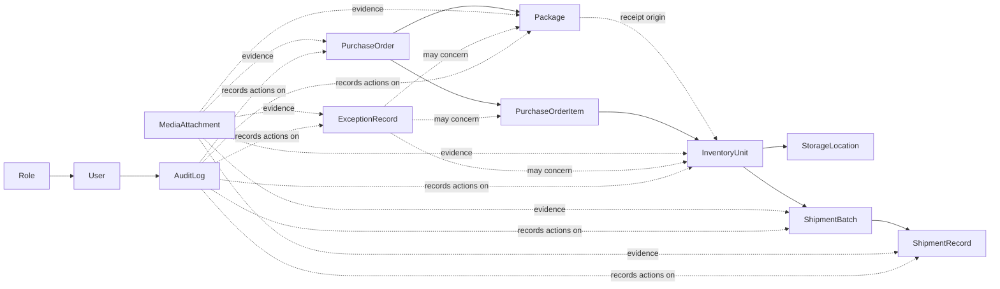

# CardFlow Domain Model

## Purpose and Boundary

CardFlow tracks a card from purchase through receiving, evidence capture, storage, and consolidated shipment to the United States. The model is deliberately limited to that chain. It is not a final database schema, API contract, accounting system, or general ERP design.

The central trace is:

`PurchaseOrder -> Package / PurchaseOrderItem -> InventoryUnit -> ShipmentBatch -> ShipmentRecord`

`MediaAttachment`, `ExceptionRecord`, and `AuditLog` provide evidence and accountability across that trace.

## Conceptual Relationship Map

The diagram expresses business relationships, not table structures or mandatory foreign keys. In particular, the attachment and audit associations need an implementation design later.

## Core Concepts

| Concept | Responsibility and relationship |
| --- | --- |
| `User` | An authenticated person operating CardFlow. A user performs permitted actions and is the accountable actor for audit events. Initially, users are either the US administrator or a China warehouse employee. |
| `Role` | The permission profile assigned to a user. The initial roles are `administrator` and `china_warehouse`. The administrator creates or cancels purchase and shipment work, sees costs, decides exception outcomes, and can spot-check or return photos. Warehouse users receive packages, submit evidence, verify cards, photograph/re-photograph, assign locations, and execute shipment work. |
| `PurchaseOrder` | The administrator-created purchasing record. It is the source of purchase context and purchase costs, and groups expected items and arriving packages. Cost information belongs in this administrative domain and must never be returned to a warehouse user by an API. |
| `PurchaseOrderItem` | An expected card line within a purchase order, such as the card name, version, and expected quantity described in the guide. It is the expected-side reference used during receipt verification and the source relationship for received physical cards. |
| `Package` | A physical parcel received in China and associated with purchase work. It holds receipt context such as courier scan/identification, outer-package observations, and the unboxing evidence. A package is the natural target for logistics damage exceptions. |
| `InventoryUnit` | Exactly one physical card, with quantity fixed at `1` and one unique internal inventory ID. It is traceable back to the expected purchase item and received package, has a lifecycle status, carries its current storage location, and can be assigned to at most one active shipment batch. The guide gives `CN-0001842` only as an example format, not a final ID specification. |
| `MediaAttachment` | Evidence attached to a business object: order screenshot for a purchase order; unboxing video for a package; front/back high-resolution card photos and issue photos for an inventory unit; submitted evidence for an exception; and packing or waybill photos for shipment work. Upload failure must be retryable without creating duplicate media records or duplicate inventory units. |
| `ExceptionRecord` | An independently actionable exception, not a free-text note. It may concern a package, purchase-order item, or inventory unit. Examples in the guide include missing/extra/wrong cards, condition issues, suspected counterfeit or description mismatch, and outer-package damage. Warehouse users submit evidence; the administrator decides the result. |
| `StorageLocation` | The physical warehouse location assigned to inventory. One location can hold many inventory units; an inventory unit has a current assigned location for retrieval and shipment verification. The guide calls for location and QR-code support but does not define a location hierarchy or QR data model. |
| `ShipmentBatch` | The administrator-created consolidated outbound task that groups multiple sellable inventory units for a US receiving address. Assigning units to it locks them together so the same card cannot be allocated to two batches. Warehouse work scans the inventory ID and location during packing. |
| `ShipmentRecord` | The outbound logistics record associated with a shipment batch. The guide identifies its evidence as package weight, waybill/label photo, and tracking number. It is not a customer order or per-buyer fulfillment record. |
| `AuditLog` | The chronological accountability record for material operations. It must identify the acting account and time, and record state changes, evidence actions, exception decisions, inventory assignment, and shipment actions. Warehouse users must not be able to modify audit history. |

## Key Relationship Rules

### Purchase and receipt

- A `PurchaseOrder` contains one or more expected `PurchaseOrderItem` records.
- A `Package` is associated with purchase work when it is received and scanned. It supplies receiving evidence and establishes the physical origin of cards found inside.
- Receipt verification compares the expected quantity on purchase-order items with actual cards received. A discrepancy creates an `ExceptionRecord` rather than allowing normal completion.
- A verified physical card becomes one `InventoryUnit`; an inventory unit is never a quantity aggregate.

### Inventory and evidence

- Each `InventoryUnit` has exactly one unique internal ID for its lifetime. Retried requests must resolve to the original unit instead of creating a second unit.
- An inventory unit is associated with front and back card photos before it can become sellable. Issue-specific evidence may also be attached.
- Purchase-order screenshots remain associated with the `PurchaseOrder`, and exception evidence remains associated with the relevant `ExceptionRecord`; neither may be reduced to an untraceable note or orphaned file.
- A `StorageLocation` represents current physical custody. The relationship must be kept accurate for shipment scanning and traceability.
- `MediaAttachment` is evidence, not merely a file list: its purpose and target need to remain traceable after upload, retry, or re-photography.

### Exceptions and auditability

- An `ExceptionRecord` is separate from the main eight-state card lifecycle. It can block lifecycle progression until the required handling is complete.
- Each exception handling step needs an accountable actor and time. Guide-listed outcomes are supplementary evidence, accepted inventory, return, refund, or closure.
- `AuditLog` crosses business-object boundaries. It records who acted and when rather than replacing the source record or its evidence.

### Shipment and exclusivity

- A `ShipmentBatch` groups many sellable inventory units for a consolidated US shipment.
- The batch lock is a business transaction: a unit cannot be in two active shipment batches, including under concurrent requests.
- `ShipmentRecord` captures dispatch evidence for the batch. Card-level status changes to shipped must remain traceable to that record.

## Permission and Data-Exposure Boundary

Role checks are not a presentation concern. The server must authorize every operation and shape every response for the caller's role.

- Purchase costs may be viewed and modified only by the administrator.
- Warehouse APIs must not return purchase-cost fields, including through nested purchase-order, item, inventory, export, search, audit, or error payloads.
- Warehouse users may submit receiving, photo, location, shipment, and exception evidence, but do not decide final exception outcomes.
- The administrator may review audit records; audit history must not be user-editable by warehouse staff.

## Deliberately Unresolved Decisions

The guide establishes the business flow but does not settle these design details. They must be decided before a final schema or API is created.

1. Package cardinality: whether one package can contain items from more than one purchase order, and whether one purchase-order item can be split across several packages.
2. Inventory-unit creation timing: the guide requires one ID per physical card before photography, but does not specify whether the server creates units during verification, at verification completion, or when photography starts.
3. Early-state owner: the first three card states occur before all physical cards may be individually identified. The implementation must decide whether those states live on an expected purchase item, a receipt line, or a provisional unit without violating the one-physical-card rule.
4. Storage-location timing: the guide requires location assignment before bulk-shipment preparation, so it is required before a card is locked. It does not say whether location assignment must also precede `sellable inventory` or can occur between sellable status and shipment locking.
5. Shipment-record cardinality: the guide depicts one logistics record after a batch; it does not define split shipments, replacement labels, or multiple carrier legs.
6. Exception lifecycle: severity levels, what counts as a "serious" unresolved exception, evidence sufficiency, and the exact state effect of accept, return, refund, and close are not specified.
7. Attachment and audit association design: whether these use typed link records, a constrained generic target mechanism, or another relational design is intentionally deferred.
8. ID, location, and QR conventions: formats, printing/scanning standards, location hierarchy, and collision handling are not specified. The example inventory ID is illustrative only.
9. Purchase-cost representation: currency, line-level versus order-level allocation, and correction history are unspecified. Only the visibility constraint is decided.
10. Media policy: supported formats, size limits, retention, replacement/version handling, and storage provider remain open pending the China connectivity/upload test.

No decision above should be filled in by an implementation shortcut. The final model should favor a small, auditable workflow at the expected volume of about 50 cards per day, rather than a generalized ERP abstraction.
